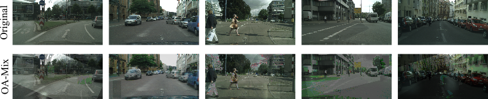
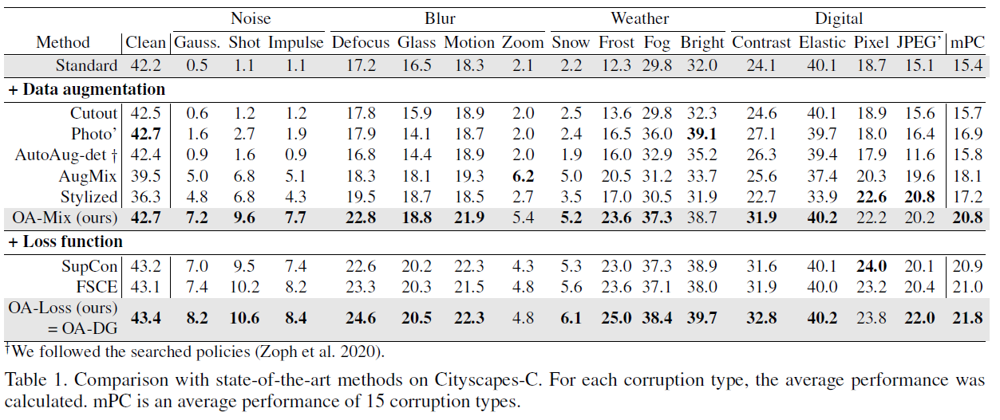
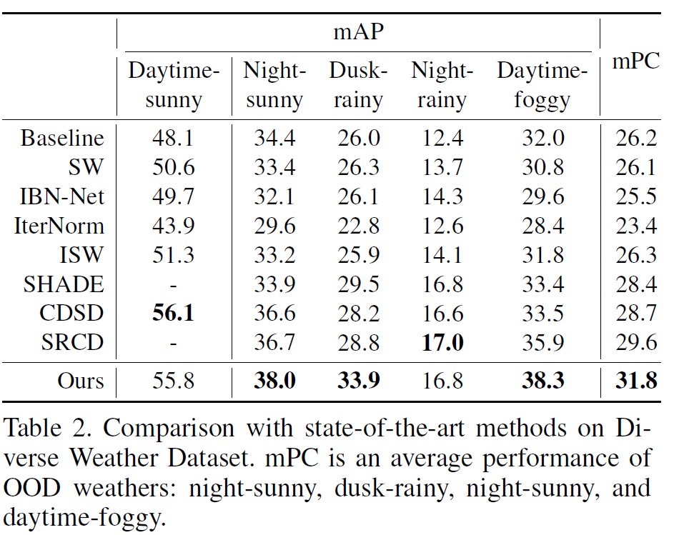

# OA-DG: Object-Aware Domain Generalization

[](https://paperswithcode.com/sota/robust-object-detection-on-cityscapes-1?p=object-aware-domain-generalization-for-object)
[](https://paperswithcode.com/sota/robust-object-detection-on-dwd?p=object-aware-domain-generalization-for-object)

**_OA-DG_** is an effective method for single-domain object detection generalization (S-DGOD). It consists of two components: _OA-Mix_ for data augmentation and _OA-Loss_ for reducing domain gaps.


> [Object-Aware Domain Generalization for Object Detection](https://arxiv.org/abs/2312.12133), **Wooju Lee<sup>*</sup>** , **Dasol Hong<sup>*</sup>** , Hyungtae Lim<sup>†</sup>, and Hyun Myung<sup>†</sup>, AAAI 2024 ([arXiv:2312.12133](https://arxiv.org/abs/2312.12133))


## ✨Features

- OA-DG consists of OA-Mix for data augmentation and OA-Loss for reducing the domain gap.

- OA-Mix increases image diversity while preserving important semantic feature with multi-level transformations and object-aware mixing.

    <details onclose>
    <summary>👀 View some example images</summary>

    
    
    </details>

- OA-Loss reduces the domain gap by training semantic relations of foreground and background instances from multi-domain.

- Extensive experiments on standard benchmarks (Cityscapes-C and Diverse Weather Dataset) show that OA-DG outperforms SOTA methods on unseen target domains.

- OA-DG can be generally applied to improve robustness regardless of the augmentation set and object detector architectures.


## 🚣 Getting Started

Follow these steps to set up the project on your local machine for training and testing.

### Prerequisites

Ensure you have the following prerequisites installed on your local system.

1. Install mmdetection: There are several installation guides. Follow one of the below:

   > Our code is forked from mmdetection 2.28.x version.
   
   a. Customize Installation (recommended)

      ```bash
      # Install MMCV using MIM.
   
      $ pip install -U openmim
      $ mim install mmcv-full
   
      # Clone this repository
      $ git clone https://github.com/WoojuLee24/OA-DG.git
   
      # Go into the repository
      $ cd OA-DG
   
      # Install mmdetection
      $ pip install -v -e .
      ```
   
   b. Refer to [the mmdetection's installation instructions](https://mmdetection.readthedocs.io/en/v2.28.2/get_started.html#installation).

   c. Use [Dockerfile](https://github.com/open-mmlab/mmdetection/blob/2.x/docker/Dockerfile) from mmdetection to setup the environment.


2. Install other dependencies
   
   ```bash
   # For image processing operations.
   $ pip install Pillow
   # For spectral-residual saliency algorithm in OA-Mix.
   $ pip install opencv-python
   $ pip install opencv-contrib-python
   ```

3. Prepare the following datasets:

   - [Cityscapes](https://www.cityscapes-dataset.com/): A dataset that contains urban street scenes from 50 cities with detailed annotations.
   - [Diverse Weather Dataset](https://drive.google.com/drive/folders/1IIUnUrJrvFgPzU8D6KtV0CXa8k1eBV9B): This dataset includes various weather conditions for robust testing and development of models, essential for applications in autonomous driving.


## 🏃 How To Run

### Training

```bash
python3 -u tools/train.py $(CONFIG).py --work-dir $(WORK_DIR)
```

<details onclose>
<summary>Example: OA-DG trained on Cityscapes dataset</summary>

```bash
python3 -u tools/train.py configs/oadg/cityscapes/oadg.py --work-dir data/oadg/cityscapes/oadg
```

</details>


### Evaluation

- Cityscapes-C
   
   ```bash
    python3 -u tools/analysis_tools/test_robustness.py \
      $(CONFIG).py $(CKPT_FILE).pth --out $(OUT_PATH).pkl \
      --corruptions benchmark --eval bbox
   ```
   
    <details onclose>
    <summary>Example: OA-DG evaluated on Cityscapes-C dataset</summary>
    
   ```bash
    python3 -u tools/analysis_tools/test_robustness.py \
      configs/oadg/cityscapes/oadg.py \
      data/oadg/cityscapes/oadg.pth \ 
      --out data/oadg/cityscapes/oadg.pkl \
      --corruptions benchmark --eval bbox
   ```
    
    </details>


- Diverse Weather Dataset (DWD) (TODO)

   ```bash
    python3 -u tools/test_dwd.py \
      $(CONFIG).py $(CKPT_FILE).pth --out $(OUT_PATH).pkl \
      --eval mAP
   ```

    <details onclose>
    <summary>Example: OA-DG evaluated on DWD dataset</summary>
    
   ```bash
    python3 -u tools/analysis_tools/test_robustness.py \
      configs/oadg/cityscapes/oadg.py \
      data/oadg/cityscapes/oadg.pth \ 
      --out data/oadg/cityscapes/oadg.pkl \
      --corruptions benchmark --eval bbox
   ```
    
    </details>


### Demo

- You can also run `demo/image_demo.py`, which is the script provided by open-mmlab/mmdetection
  
    <details onclose>
    <summary>Example: Object detection results in demo image using OA-DG</summary>
    
     ```bash
     python3 demo/image_demo.py demo/demo.jpg \
        configs/oadg/cityscapes/oadg.py \
        --weights data/oadg/cityscapes/oadg.pth
     ```
    </details>


## Results
We evaluated the robustness of our method for 
common corruptions and various weather conditions in urban scenes.
mPC is an evaluation metric of robustness against out-of-distribution (OOD).


- Cityscapes-C: 
- DWD: 
<p align="center">
    
</p>


## TODO list
- [x] Add instructions
- [ ] Add codes
- [ ] Pull request to MMDetection


## 📢 License

Please see the [LICENSE.md](LICENSE.md) file.

## 📫 Contact Information
If you have any questions, please do not hesitate to contact us:


- Wooju Lee ✉️ dnwn24@kaist.ac.kr
- Dasol Hong ✉️ ds.hong@kaist.ac.kr


## 📎 Citation

```shell
@misc{lee2023objectaware,
      title={Object-Aware Domain Generalization for Object Detection}, 
      author={Wooju Lee and Dasol Hong and Hyungtae Lim and Hyun Myung},
      year={2023},
      eprint={2312.12133},
      archivePrefix={arXiv},
      primaryClass={cs.CV}
}
```
